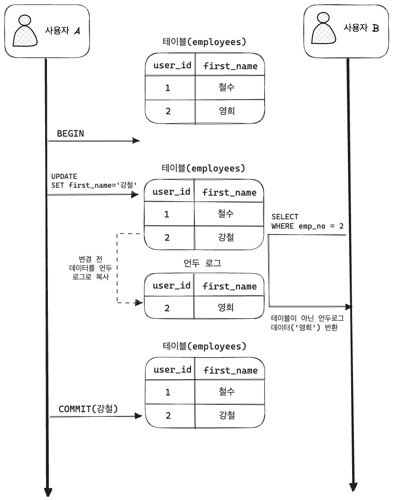
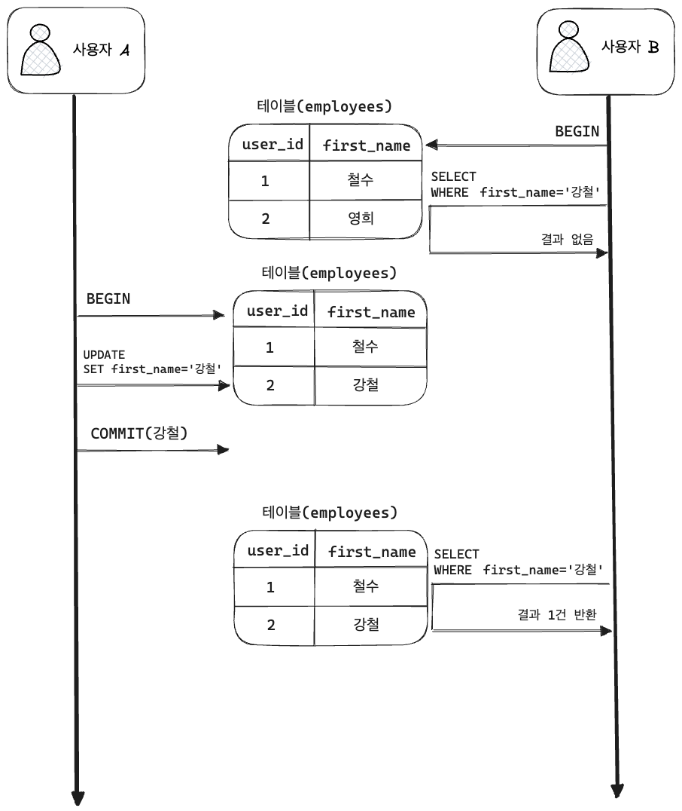
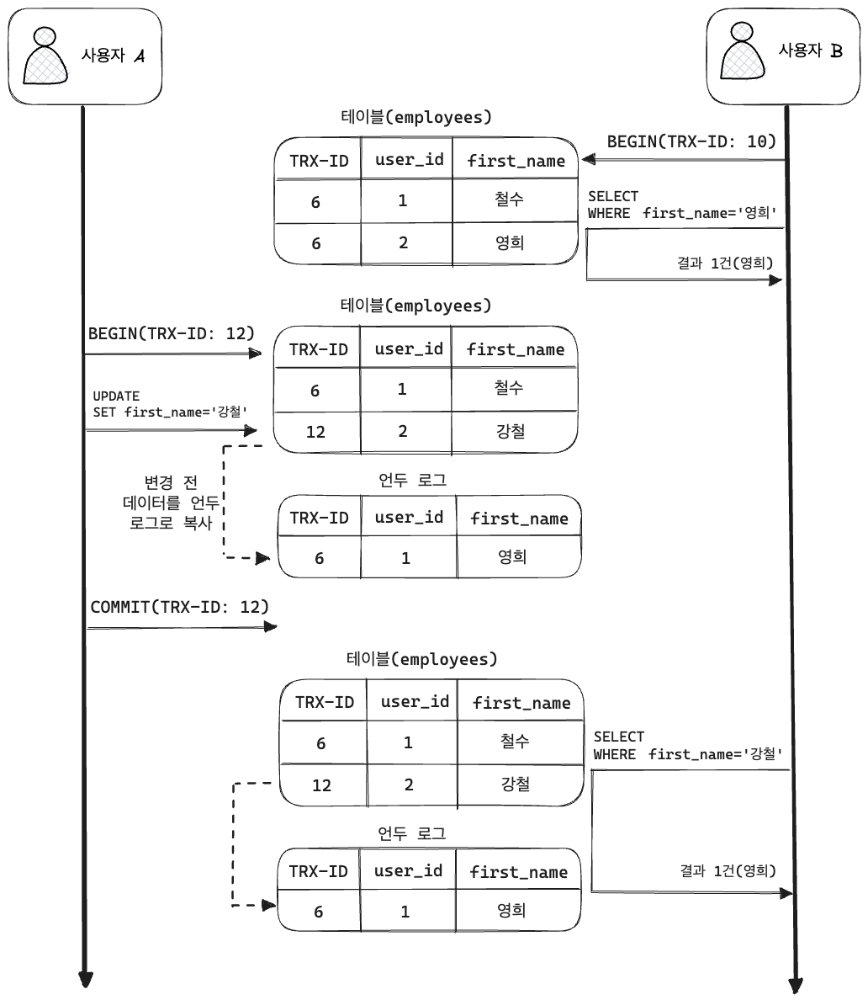
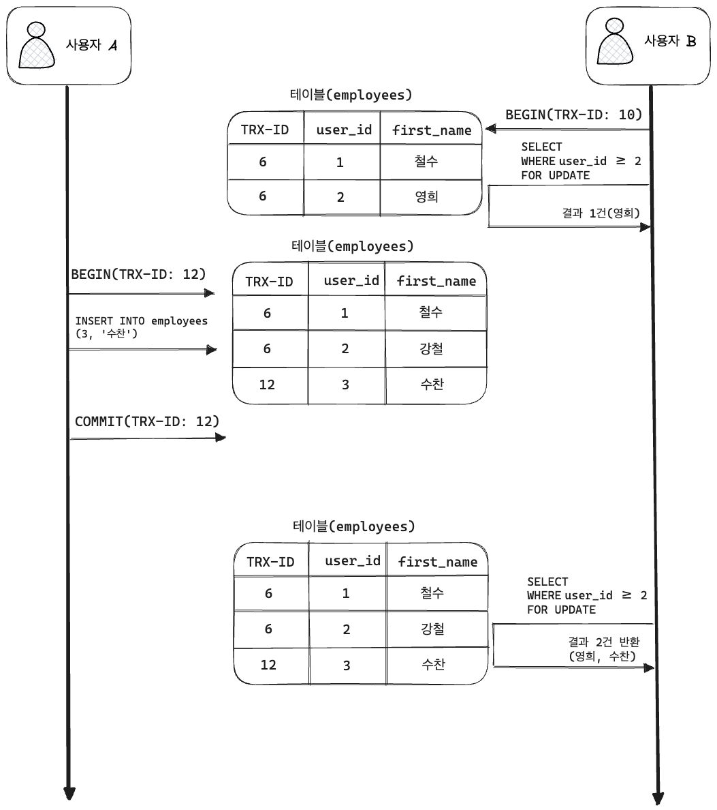

DB 면접 질문으로 단골로 나오는 개념입니다.

# 트랜잭션 격리 수준(Isolation Level)

## Isolation Level 이란?

> 트랜잭션에서 일관성 없는 데이터를 허용하도록 하는 수준

여러 트랜잭션이 동시에 처리 될 때, 특정 트랜잭션이 다른 트랜잭션에서 변경하거나 조회하는 데이터를 볼 수 있게 허용 할 지 말지를 결정하는 것입니다.

## Isolation Level 필요성

DB는 ACID 특징과 같이 트랜잭션이 독립적인 수행을 하도록 합니다.
 고로 락을 통해 트랜잭션 작업이 수행되는 동안 다른 트랜잭션이 관여하지 못하도록 막는 것이 필요합니다.

하지만 무조건 락을 통해 수행되는 수많은 트랜잭션을 **순서대로 처리**하게 되면 **성능 저하**가 일어납니다.
 그렇다고 성능을 높이기 위해 **락의 범위를 줄이면**, 잘못된 값이 들어가 **데이터 무결성을 해치게 됩니다.**

> 동시성을 증가시키면 데이터 무결성에 문제가 발생하고, 데이터 무결성을 유지하면 동시성이 떨어집니다.

### 🤔 하지만?

격리 수준이 높아질수록 MySQL 서버의 처리 성능이 많이 떨어질 것으로 생각하는 사용자가 많은데,
 사실 SERIALIZABLE 격리 수준이 아니라면 크게 성능 개선이나 저하는 발생하지 않는다고 합니다.

## Isolation Level 종류

먼저 격리 수준을 이야기 할때 항상 언급되는 세 가지 부정합 문제가 있습니다.
 이는 격리 수준 레벨에 따라 발생할 수도, 발생하지 않을 수도 있습니다.

|                  | DIRTY READ | NON-REPEATABLE READ |     PHANTOM READ      |
|------------------|:----------:|:-------------------:|:---------------------:|
| READ UNCOMMITTED |   🙆‍♂️    |        🙆‍♂️        |         🙆‍♂️         |
| READ COMMITTED   |     ❌      |        🙆‍♂️        |         🙆‍♂️         |
| REPEATABLE READ  |     ❌      |          ❌          | 🙆‍♂️ (InnoDB는 없음) |
| SERIALIZABLE     |     ❌      |          ❌          |           ❌           |

이제 격리 레벨을 하나하나 알아보겠습니다. 😎

### READ UNCOMMITTED

- 이 레벨에서는 각 트랜잭션의 변경 내용이 COMMIT, ROLLBACK 여부에 상관없이 다른 트랜잭션에 보입니다.

하지만 사용자 A가 처리 도중 알수 없는 문제가 발생해서 등록된 데이터가 ROLLBACK 된다고 해도,
 여전히 사용자 B는 영희가 존재한다고 생각하고 처리한다는 문제가 있습니다.

이처럼 어떤 트랜잭션에서 처리한 작업이 완료되지도 않았는데,
 다른 트랜잭션에서 볼 수 있는 현상을 Dirty Read라고 합니다.

그리고 이 레벨은 RDMBS 표준에서는 트랜잭션의 격리 레벨로 인정하지 않을 정도로,
 **정합성에 문제가 많은 격리 레벨입니다.**

> MySQL을 사용한다면 최소 READ COMMITTED 이상의 격리 레벨을 사용할 것을 권장합니다.

### READ COMMITTED

- READ COMMITTED는 오라클 DBMS에서 기본으로 사용되는 격리 수준 입니다.
   (온라인 서비스에서 가장 많이 선택되는 격리수준이라고 합니다.)
- 이 레벨에서는 Dirty Read 현상은 발생하지 않습니다.
- 어떤 트랜잭션에서 데이터를 변경 해도, COMMIT이 완료되면 다른 트랜잭션에서 조회 가능합니다.

위 그림을 보시면 (사용자 B)의 SELECT 결과는 employee 테이블이 아닌 **언두 영역에 백업된 레코드를 가져온 것입니다.**

**READ COMMITTED 레벨에서는 어떤 트랜잭션의 변경 내용이 커밋되기 전까지 다른 트랜잭션에서는 그러한 변경 내용을 조회할 수 없습니다.**

---

> 🚨 그런데 말입니다...?

READ COMMITTED 격리 수준에서도 NON-REPEATABLE READ 라는 부정합 문제가 있습니다.
  아래의 사진을 보면서 알아봅시다. 🤔

- B의 트랜잭션 내에서 첫번째 조회(`SELECT 강철`)때는 결과 없었습니다.
- 하지만 이 와중에 A가 영희를 강철로 이름을 탈바꿈 하고 커밋을 해버립니다.
   (**아직 B의 트랜잭션이 끝나지 않음!!!**)
- 그리고 B가 재조회 했을 때는 강철이라는 결과가 반환됩니다.

동일한 쿼리를 2번 날렸는데 결과가 다르다는 것은... 😓
 **하나의 트랜잭션 내에서 똑같은 SELECT 쿼리를 실행 했을 때 항상 같은 결과를 가져와야 한다는 'REPEATABLE READ' 정합성에 어긋납니다.**

### REPEATABLE READ

- MySQL의 InnoDB 스토리지 엔진에서 기본적으로 사용되는 격리수준 입니다.
- 바이너리 로그를 가진 MySQL 서버에서는 최소 REPEATABLE READ 격리 수준 이상을 사용해야 합니다.
- 이 격리 레벨에서는 NON-REPEATABLE READ 부정합이 발생하지 않습니다.

InnoDB 스토리지 엔진에서는 트랜잭션이 ROLLBACK 될 가능성에 대비해 변경되기 전,
 레코드를 언두(Undo) 공간에 백업해두고 실제 레코드 값을 변경합니다.
 이러한 변경 방식을 **MVCC(Multi Version Concurrency Control)**이라고 합니다.

모든 InnoDB의 트랜잭션은 고유한 트랜잭션 번호(순차적 증가 값)을 가집니다.
 Undo 영역에 백업된 모든 레코드도 변경 발생시킨 트랜잭션 번호를 포함하고 있습니다.
(그리고 Undo 영역에 백업된 데이터는 InnoDB 스토리지 엔진이 불필요하다고 판단하는 시점에서 주기적으로 삭제됩니다.)

**REPEATABLE READ 격리 레벨에서는 MVCC를 보장하기 위해 트랜잭션 가운데 가장 오래된 트랜잭션 번호보다 앞선 Undo 영역의 데이터는 삭제할 수 없습니다.**

> 📌 REPEATABLE READ와 READ COMMITED 차이는 Undo 영역에 백업된 레코드의 여러 버전 가운데 몇번 째 이전 버전까지 들어가느냐에 있습니다.

위 그림에서 REPEATABLE READ 격리 레벨의 작동 방식을 보여 줍니다.
 사용자 A가 중간에 데이터 변경 후 COMMIT을 했지만 트랜잭션 번호가 B의 번호보다 작기 때문에!
 사용자 B는 자신의 번호보다 작은 번호에서 **변경된 것만** 보게 됩니다.
 이러한 방식으로 REPEATABLE READ를 보장하게 됩니다.

- 하나의 레코드에 대한 백업이 여러개 존재할 수 있고,
- 만약 한 사용자가 트랜잭션을 장기간 가지게 되면 Undo 영역이 백업된 데이터로 무한정 커질 수 있으니 주의해야 합니다.

---

> 🚨 그런데 말입니다...?

REPEATABLE READ에서도 PHANTOM READ와 같이 부정합이 발생할 수 있습니다.

그림과 같이 B의 트랜잭션 내에서 없던 수찬이가 갑자기 보이는 것을 PHANTOM READ라고 합니다.
 `SELECT ... FOR UPDATE` 쿼리는 SELECT 하는 레코드에 쓰기 잠금을 걸어야 하는데,
 언두 레코드에는 잠금을 걸수 없어서, Undo 영역의 변경 전 데이터가 아닌 현재 레코드 값을 가져옵니다.

### SERIALIZABLE

가장 단순한 격리 레벨이며 가장 엄격한 격리 레벨입니다.
 트랜잭션이 완료될 때까지 SELECT 하는 레코드에 모두 변경하지 못하게 됩니다.
 즉, 한 트랜잭션에서 읽고 쓰는 레코드를 다른 트랜잭션에서는 절대 접근 불가능합니다.

SERIALIZABLE 격리 레벨에서는 일반적인 DBMS에서 일어나는 PHANTOM READ가 발생하지 않습니다.
 하지만 그만큼 동시 처리 성능도 다른 트랜잭션 격리 레벨보다 떨어집니다.

> 그리고 InnoDB 스토리지 엔진에서는 갭 락과 넥스트 키 락 덕분에 REPEATABLE READ 격리 수준에서도 PHANTOM READ가 발생하지 않기 때문에 굳이 SERIALIZABLE 를 사용할 필요가
> 없다고 합니다.