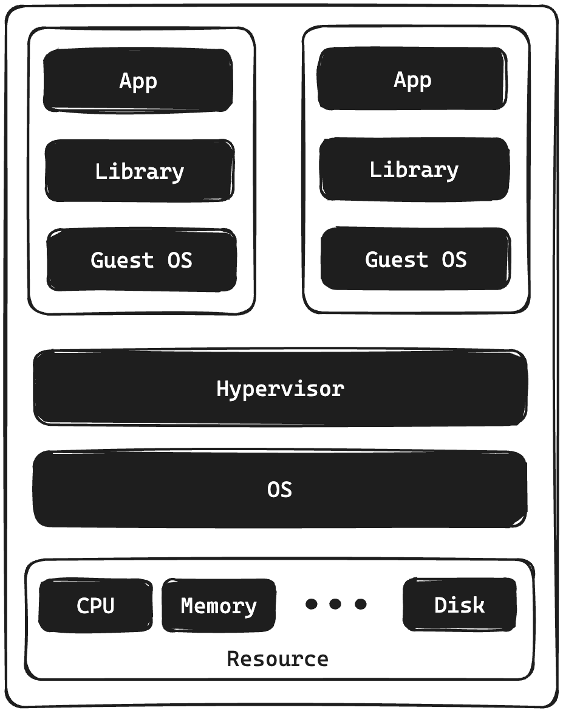
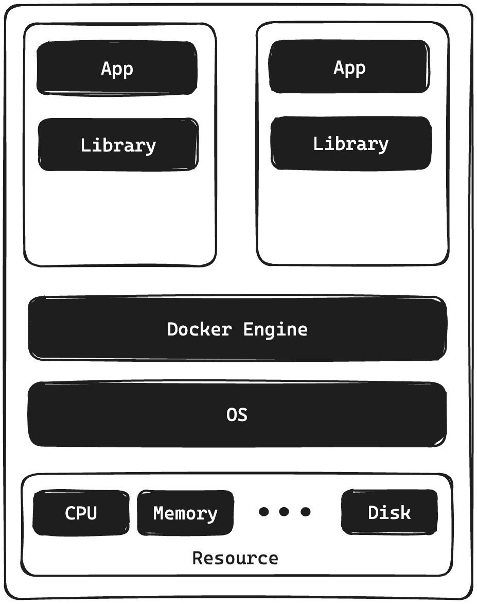
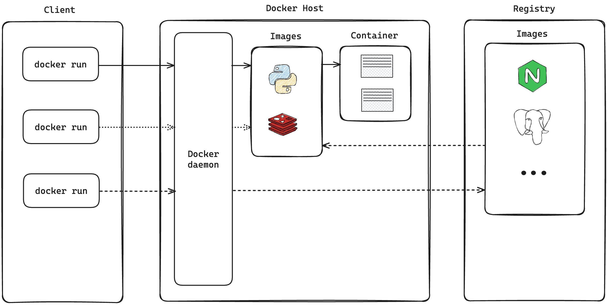
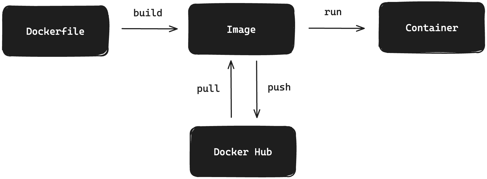

## Docker 란 무엇일까요?

- Open Platform 입니다.
- 어플리케이션에서 인프라를 분리시켜 줍니다.
- 신속합니다.
- 인프라를 어플리케이션 관리하는 것 처럼 관리 할 수 있습니다.
- 코드 배포에 용이합니다.

- 컨테이너 기반 가상화 도구
   (리눅스 컨테이너 기술인 LXC(Linux Containers) 기반)
- 어플리케이션을 컨테이너라는 단위로 격리하고 실행하고 배포하는 기술입니다.
- 다양한 운영체제에서 사용할 수 있으며,
   컨테이너된 어플리케이션을 손쉽게 빌드, 배포, 관리할 수 있는 다양한 기능을 제공합니다.
- 위 기능들을 통해 어플리케이션을 빠르게 개발하고, 효율적으로 배포, 관리할 수 있습니다.

### Container는 무엇일까요?

- 컨테이너는 가상의 기술 중 하나 입니다.
- 호스트 운영체제 위에 여러 개의 격리된 환경을 생성합니다.
- 각각의 컨테이너 안에서 어플리케이션을 실행합니다.

## 가상화(Virtualization) 기술이란 무엇일까요?

하나의 물리적인 컴퓨터 자원(CPU, 메모리, 저장장치 등)을
 가상적으로 분할 하여 여러 개의 가상 컴퓨터 환경을 만들어 내는 기술입니다.

이를 통해 물리적인 컴퓨터 자원을 더욱 효율적으로 사용할 수 있으며,
 서버나 어플리케이션 등을 운영하는데 있어 유연성과 안정성을 제공합니다.

### 하이퍼바이저(Hypervisor)란?

- 가상머신(Virtual Machine, VM)을 생성하고 구동하는 소프트웨어
- OS에 자원을 할당 및 조율
- OS들의 요청을 번역하여 하드웨어에 전달

대표적으로 `vmware` 가 있습니다.

### Virtual Machine vs Container

- Virtual Machine과는 다르게 Docker에는 Guest OS가 올라가지 않습니다.
- 컨테이너는 Docker-engin 위에 application에 실행할 필요한 바이너리만 올라갑니다.
- 그 외의 커널 부분은 호스트의 커널을 공유하게 되빈다.
- 호스트의 커널과 container의 터널과 다르다면? 다른 부분 만큼만 패키징 됩니다.

이를 통해 가벼워집니다.

### 컨테이너 기반 특징

- 리눅스 커널의 기능을 사용하여 만들어졌습니다.
  - chroot: 파일 시스템을 격리
  - namespace : 프로세스 격리
  - group : 하드웨어 자원 격리
- 프로세스 단위의 격리 환경입니다.

## Docker Architecture

### 도커 데몬 (Docker daemon == dockered)

- 도커 엔진의 핵심 구성 요소
- 도커 호스트에서 컨테이너를 관리하고 실행하는 역할
- 컨테이너를 생성, 시작, 중지, 삭제하는 등의 작업을 수행
- 컨테이너 이미지를 관리 하고,
- 외부에서 이미지를 다운로드하고 빌드하는 작업을 수행

### Docker Object

- 도커 이미지 : 도커 컨테이너를 만들기 위한 읽기 전용 템플릿
- 도커 컨테이너 : 도커 하나의 이미지의 실행 가능한 인스턴스
   (어플리케이션을 실행하기 위한 모든 파일과 설정 정보를 포함하는 패키지 입니다.)

### 도커 레지스트리 (Docker Registries)

- 도커 이미지 (Docker Image)를 관리하고 저장하는 곳 입니다.
- Docker hub: 디플토 레즈스트리, 누구나 접근 가능한 공개형 저장소 입니다.

## 도커 네트워크

## 컨테이너 라이프 사이클

### run vs start

- run : create + start로 새 컨테이너를 생성하고 시작합니다.
- start : 이미 존재하는 컨테이너를 시작합니다.

### stop vs kill 명령어의 차이

- stop : **gracefull 하게** 컨테이너를 **중지** 시킵니다.
   (ex: 하고 있는 작업이 있다면 그 작업이 끝나고 중지 시킵니다.)
- kill : 어떠한 작업도 기다리지 않고 **즉각적으로 중지시킵니다.**

## Dockerfile

