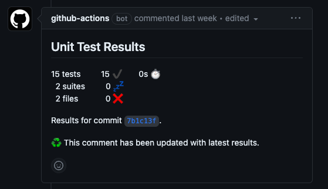

작성한 문서는 아래와 같습니다. 😁

## Git Workflow 문서

```yaml
name: CI Test

on:
  push:
    branches:
      - main
      - release
      - develop
  pull_request:
    branches:
      - main
      - release
      - develop

permissions:
  contents: read
  issues: read
  checks: write
  pull-requests: write

jobs:
  test:
    runs-on: ubuntu-latest
    steps:
      - name: Repository 가져오기
        uses: actions/checkout@v3

      - name: JDK 11 설치
        uses: actions/setup-java@v1
        with:
          java-version: 11
          distribution: "temurin"

      - name: Gradle 명령을 위한 권한 부여
        run: chmod +x gradlew

      - name: Gradle Build 수행!
        run: ./gradlew build

      - name: 테스트 결과를 PR-Comment 로 등록
        uses: EnricoMi/publish-unit-test-result-action@v1
        if: always()
        with:
          files: "**/build/test-results/test/TEST-*.xml"

      - name: 테스트 실패 시, 실패한 코드 라인에 Check Comment 를 등록
        uses: mikepenz/action-junit-report@v3
        if: always()
        with:
          report_paths: "**/build/test-results/test/TEST-*.xml"
          token: ${{ github.token }}
```

## JDK 11 - Temurin 사용 이유

자연스레 `JDK 17`을 사용하고 있었는데... 😓
<br>해당 버전은 라이센스가 있어 추후에 문제가 있을 수 있다는 것을 알게되었습니다.

- 관련 글 링크 : https://www.lesstif.com/java/jdk-whichjdk-com-125305293.html

**Temurin은 OpenJDK를 기반으로 무료 및 오픈소스 입니다.**
<br>그래서 많은 곳에서 사용되고 있어 이를 추천합니다.

## EnricoMi 사용하기

- Github 링크 : https://github.com/EnricoMi/publish-unit-test-result-action

테스트 결과를 분석하고 결과를 Github에 게시해주는 도구 입니다.



위와 같이 Pull Request 에서 확인할 수도 있고,
<br> 테스트 실패 시, 해당 실패 구문에 코멘트도 작성해줍니다.
