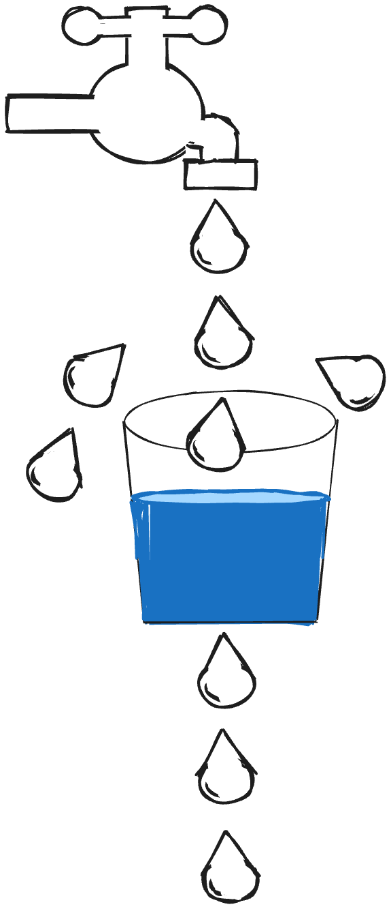

수많은 클라이언트들의 동시다발적인 요청이 계속 보내지게 되면,
 서버에 과부하가 걸리고 결국에는 `shut down` 되는 위험이 있을 수 있습니다.

이러한 위험을 방지하기 위한 방법이 바로 요청에 제한을 두는 것입니다.

Rate Limiter 를 구현하는 방식으로는 다음과 같은 방법들이 있습니다.

## Rate Limiter 구현? 방법

### API를 관리 플랫폼(`Business Products`) 사용하기

- tyk.io, apigee, cloudflare 등으로 따로 구현하지 않고 사용만으로 처리할 수 있습니다.
- 단점으로는 비용이 비쌀 수 있다는 점과,
- 필요한 것 이상의 필요치 않는 기능을 위해 돈을 내야 된다는 점이 있습니다.

### API를 관리 서비스(`Cloud Service`) 사용하기

- AWS API Gateway, Google Cloud API Gateway
- 간편하긴 하지만 내 입맛에 맞게 조정하는 데는 한계가 있을 수 있습니다.

> 대부분 기업들은 자체적으로 Rate Limiter를 구현하는 경우가 많다고 합니다.

## Rate Limit 필요성

- Dos 공격(Denial-Of-Service attack)에 대한 시스템 보호할 수 있습니다.
   : 특정 API로 수많은 요청을 통해 서버를 다운 시키는 공격
- 365일 서버를 안정적으로 운영할 수 있습니다.
- 사용자들 간에 요청에 대한 공정성을 위해서 입니다.
   : 한 사용자의 너무 많은 요청으로, 다른 사용자가 이용하지 못하게 되지 않도록 방지
- 사용자가 유료/무료 버전에 따라 API를 제한할 수도 있습니다. (부가적인 기능)
   : Youtube API나 일반적인 외부 API의 경우에는 일일 횟수 제한이 있습니다.

## Rate Limit Flow

- A 클라이언트가 너무 많은 요청을 보내서 Rate Limit에 걸리는 경우,
- 서버는 `**429 Too Many Requests**` 상태코드 반환합니다.

> 429 응답을 반환할 때, 헤더에 [Retry-After: 2400] 정보를 함께 보내는 것을 권고하고 있습니다.
>  (Retry-After: 얼마 후에 다시 요청해 달라는 요청)

## Rate Limit 구현 방법

- Global API Rate Limiting
- Per User API Rate Limiting

> 일반적으로는 위의 2가지를 모두 함께 사용하게 됩니다.

### 🤔 Rate limiting in production?

규모가 있는 경우에는 서버가 여러 인스턴스로, 여러 클러스터로 구성되는 경우가 많습니다.
이 경우에는 요청이 공평하게 분배 되도록 **Load Balancer**를 사용하게 됩니다.

그리고 Redis Store를 별도로 두어서 사용자 별로 요청 횟수를 기록합니다.
서버는 Redis 조회되는 정보로 요청의 승인/거부를 판단합니다.

## Rate Limit 알고리즘 종류

### 1. Fixed Window Counter

- 정해진 시간 단위로 window가 만들어 지고 요천 건수가 기록 됩니다.
- window의 요청 건수가 정해진 건수보다 크면 해당 요청은 거부됩니다.

> 🔥 하지만 경계 시간대(18:59, 17:01에 몰리면)에 요청이 오면 두 배의 부하를 받게 됩니다.

즉 구현은 쉽지만, 구간 경계의 트래픽 편향 문제가 발생됩니다.

### 2. Sliding Window

- Fixed Window Counter 단점의 경계 편향을 보안한 위한 알고리즘 입니다.
- 요청이 들어온 시간대 앞 뒤로 조금 조금씩 살펴 이전의 윈도우까지 살펴서 총 몇번의 요청이 들어왔는지 검사합니다.

> 🔥 하지만 window 요청건에 대해 로그 관리를 해야 하므로 구현과 메모리 비용이 높은 문제가 있습니다.

### 3. Leaky Bucket

동시다발적으로 들어오는 요청들을 양동이에 담아놓고,
 양동이 밑에 구멍을 뚫어 천천히 떨어지도록 만드는 기법입니다.

장점은 동시다발적으로 많은 요청이 들어와도 결국은 일정 간격으로 천천히 처리를 하기 때문에,
 서버의 과부화를 줄일 수 있습니다.

하지만 특정 시간대에 많은 요청이 필요한 경우라면,
 예를 들어 특정 시간대에 유명 가수의 콘서트 티켓을 예매해야 된다면,
 이 방식은 적절하지 않을 수 있습니다.

왜냐하면 양동에 물이 가득 차게되면 그 외에 요청들은 처리할 수 없기 때문입니다.

### 4. Token Bucket

양동이에 주기적으로 토큰이 채워져 있고,
 요청이 들어오면 이 토큰을 가지고 요청할 수 있게끔 하는 방식 입니다.

그래서 **토큰을 배치하는 속도를 기반으로 요청 속도를 제어할 수 있습니다.**
